# Hi 👋, I'm Matheus Rocha

**Software Developer at EmpreendaAqui | 5th-semester Systems Analysis and Development student at IFSP**

I mostly work with NestJS and React. I also contribute to the [Capivara Solidária](https://capivara-solidaria.com.br/) project.

## Animation

<picture>
	<source media="(prefers-color-scheme: light)" srcset="./assets/ambient-wave-light.svg" />
	<source media="(prefers-color-scheme: dark)" srcset="./assets/ambient-wave.svg" />
	
</picture>
